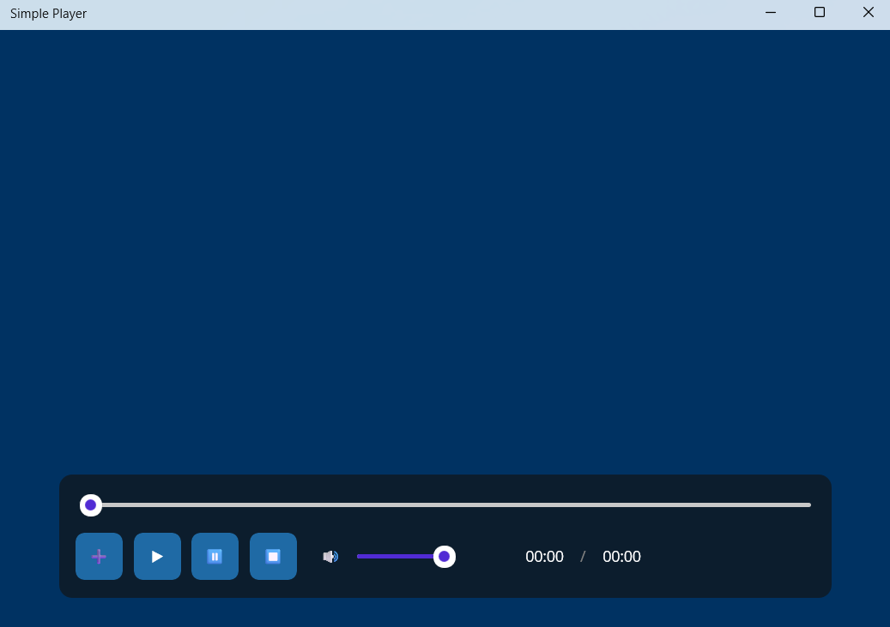

# UA 🇺🇦

# Simple Player 🎵🎥 — Посібник користувача

**Simple Player** — це сучасний, легкий та швидкий медіаплеєр для Windows. Головна особливість програми — стильний та унікальний темно-синій дизайн, створений для того, щоб ви могли комфортно слухати музику та дивитися відео без зайвого навантаження на систему.

---

## ✨ Основні можливості програми

*   **Ексклюзивний дизайн (Dark Theme):** Комфортний темно-синій інтерфейс, де всі кнопки, повзунки гучності та смуга прокручування треку кастомізовані для приємного візуального досвіду.
*   **Фірмовий стиль:** Програма має власну красиву синю іконку, яка відображається на робочому столі, панелі завдань Windows та у верхній частині вікна плеєра.
*   **Швидкість роботи:** Завдяки сучасній платформі .NET MAUI плеєр запускається миттєво та не перевантажує комп'ютер.

---

## 📸 Як виглядає програма

*(Скріншот плеєра з'явиться тут, щойно ви додасте його до папки images)*

---

## 📦 Інструкція з інсталяції та використання

### Крок 1. Завантаження програми
Щоб отримати офіційну робочу версію плеєра, перейдіть у розділі **[Releases](https://github.com/vlad7luschan/SimplePlayer/releases)** на сторінці цього репозиторію та завантажте файл з назвою `SimplePlayer_Setup.exe`.

### Крок 2. Встановлення (Setup)
1. Знайдіть завантажений файл `SimplePlayer_Setup.exe` на своєму комп'ютері та запустіть його.
2. Дотримуйтесь простих підказок інсталятора (натискайте *"Далі"*).
3. Програма автоматично встановиться у вашу систему та створить зручний синій ярлик програми **Simple Player** на вашому Робочому столі та в меню "Пуск".

### Крок 3. Як користуватися плеєром
1. Запустіть програму подвійним кліком по ярлику на Робочому столі.
2. Використовуйте нижню панель керування для контролю медіафайлів:
   * **Кнопки Керування:** Запускайте відтворення, ставте на паузу або перемикайте треки за допомогою кастомних кнопок.
   * **Повзунок часу:** Перетягуйте повзунок на треку, щоб швидко перемотати аудіо чи відео на потрібний момент.
   * **Регулятор гучності:** Зручно налаштовуйте рівень звуку прямо всередині плеєра.

---
---

# US 🇺🇸

# Simple Player 🎵🎥 — User Guide

**Simple Player** is a modern, lightweight, and fast media player designed specifically for Windows. The standout feature of this application is its sleek, custom deep-blue interface, engineered to deliver a comfortable audio and video playback experience without bloating your system.

---

## ✨ Key Features

*   **Custom UI / Dark Theme:** A fully unique deep-blue user interface featuring uniquely styled control buttons, track progress bars, and volume sliders for a pleasant visual experience.
*   **Custom Branding:** Seamless integration of a distinctive blue application icon that renders perfectly in Windows Explorer, the Taskbar, and the window Title Bar.
*   **High Performance:** Built on top of the modern .NET MAUI framework, ensuring instant startup times and low hardware resource consumption.

---

## 📸 Application Preview

*(Your application screenshot will appear here once added to the images folder)*

---

## 📦 Installation & How to Use

### Step 1. Download the Installer
To get the official stable build of the player, navigate to the **[Releases](https://github.com/vlad7luschan/SimplePlayer/releases)** section on this GitHub page and download the setup file named `SimplePlayer_Setup.exe`.

### Step 2. Running the Setup Wizard
1. Locate the downloaded `SimplePlayer_Setup.exe` file on your PC and double-click to launch it.
2. Follow the simple installation wizard prompts (click *"Next"*).
3. The setup will automatically install the app onto your system and place a handy **Simple Player** shortcut with its custom blue icon right onto your Desktop and Start Menu.

### Step 3. Using the Player
1. Launch the application via the Desktop shortcut.
2. Use the intuitive bottom control bar to manage your playback:
   *   **Control Buttons:** Easily play, pause, or skip tracks using the custom-designed buttons.
   *   **Progress Slider:** Click and drag the track progress slider to quickly seek to any part of your media file.
   *   **Volume Control:** Adjust the sound output levels seamlessly using the built-in volume slider.
